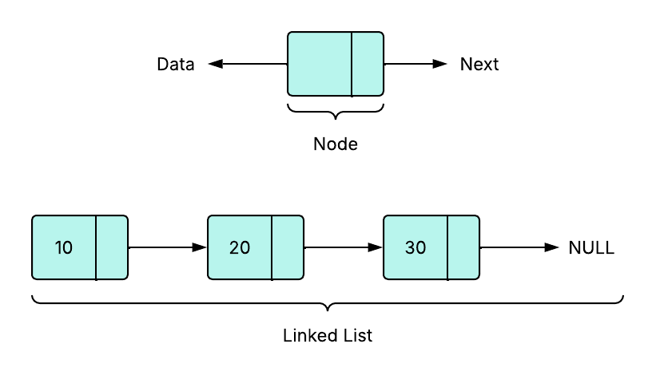

# 🔗 Linked List

An implementation of the singly linked list data structure using the principles of Object-Oriented Programming.

---

## 🤔 What is a linked list?

A linked list is a linear data structure where data is stored in nodes and these nodes are connected using pointers. Linked list is stored in non-contiguous memory locations, meaning nodes are stored anywhere in the memory but only connected logically through these links.

<p align="center">
    
</p>

---

## 🧱 Structure of a Linked List

Each node contains:

1. **Data** - The value.
2. **Next** - A reference or pointer to the next node.

---

## 📘 Analogy

Imagine a linked list like a treasure map.

-   Each clue (node) tells us where the next clue is located.
-   We cannot skip any clues and have to move through clues (nodes) one after the another (linearly) and ultimately reach the end.

---

## ⚒️ Implementation

This implementation contains:

-   `Node` class - represents a single node in the list.
-   `LinkedList` class - Handles insertion, deletion, and printing the elements of the list.
-   `UnderflowError` exception class - raised when the list is empty and some operations are being performed.
-   `OutOfRangeError` exception class - raised when trying to access an index that is not in the valid range of the list.

---

## 📄 Example

1. Creating list

```python
l_list = LinkedList()
```

2. Adding nodes

```python
# 10, 20, 30 added back to back.

l_list.add(10)
l_list.add(20)
l_list.add(30)
```

3. Printing the list

```python
l_list.print_list()

# Output = 10 -> 20 -> 30 -> NULL
```

4. Deleting the 2<sup>nd</sup> node

```python
l_list.delete(2)

# 20 gets deleted from the list.
# Updated list = 10 -> 30 -> NULL
```

5. Tring to delete an invalid index

```python
l_list.delete(-1)

# Raises OutOfRangeError exception
```
